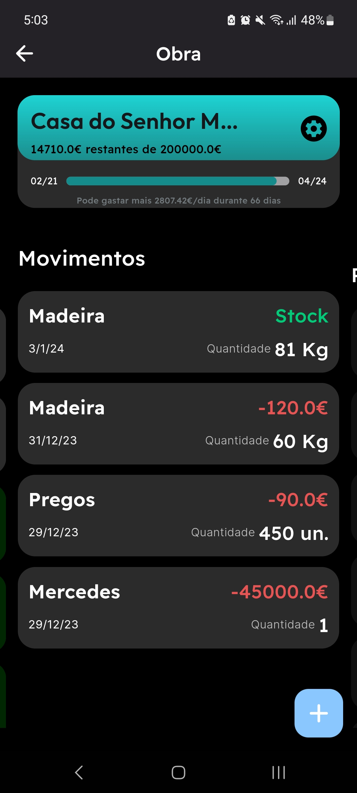
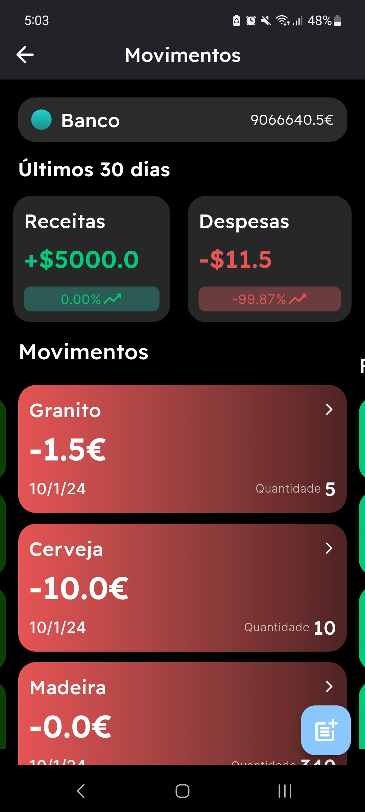

# Money

A budget management mobile application for a construction company.

## Features

- [X] Three roles with different pages and functionalities
  - [X] Worker
  - [X] Contractor
  - [X] CEO/CFO
- [X] Tasks and requests systems for Workers
- [X] Different types of management for CEO/CFO and Contractors
  - [X] Works
  - [X] Workers
  - [X] Workers tasks
  - [X] Budgets
  - [X] Materials
  - [X] Requests

### Backend-as-a-Service (BaaS)

[Supabase](https://supabase.io/) was utilized as the backend-as-a-service (BaaS) for this mobile application. It simplifies the process of connecting, managing, and interacting with the backend, allowing for seamless integration and data handling.

## Running

Simply run the provided script:
```bash
flutter run
```

It is assumed you have flutter instaled on your machine.

## Screenshots
  
